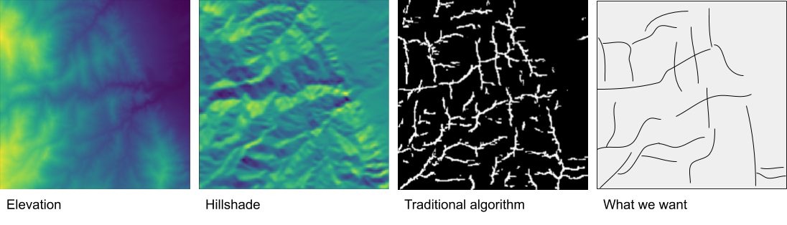

# Ridges

The goal is to develop a deep learning model for identifying ridges in topography. The approach is to develop a deep semantic segmentation model which takes a [digital elevation model](https://www.wikiwand.com/en/Digital_elevation_model) and labels which pixels correspond to ridge lines and which do not. There are two reasons why using a deep learning model for finding ridges might make sense. Number one is that traditional image processing approaches to this problem, or at least the ones I've tried, don't work very well. The second is that it's difficult to define what ridge is. I've failed to come up with a precise definition of "ridge" which matches my own intuition about what is a ridge and what is not. And it is in cases like this of ill defined categories where deep learning is most valuable. For example, it's impossible to define a set of rules that distinguish an image of a cat from a dog.

### Install requirements

    $ pip install -r requirements.txt
    $ export RIDGES_ROOT=/path/to/this/repo

### Download training data

    from dataset import *
    from config import COLORADO_BOUNDS

    harvest_tiles(COLORADO_BOUNDS)
    png_to_tif(png_dir, tif_dir)
    create_masks(tif_dir, mask_dir)

### Train model

    $ python train.py